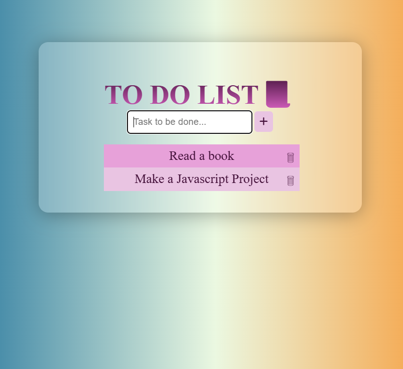

# 🍔 Food Delivery App (Frontend)

A responsive and interactive frontend for a food delivery application built using **HTML**, **CSS**, and **JavaScript**.

## 📸 Screenshot

## 🛠️ Features

- Responsive layout for mobile and desktop
- Animated navigation and transitions
- Interactive menu with clickable food items
- Add to cart functionality with item counter
- Scroll animations and hover effects

## 📁 Folder Structure

project-root/
│
├── index.html # Main landing page
├── style.css # Main stylesheet
├── script.js # JavaScript logic
├── images # img1.png

@Mayuri Chatap 💗